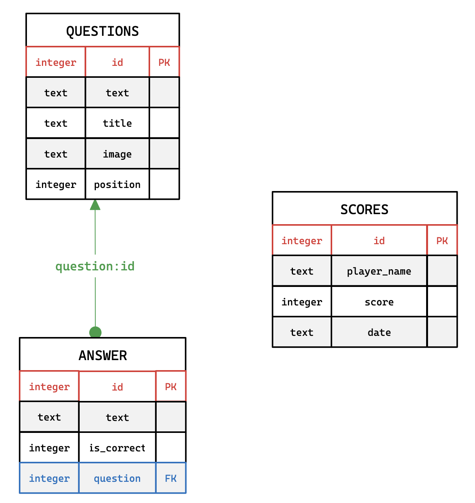

# Web-Front-Back-Quiz ESIEE
Bienvenue dans le projet Web-Front-Back-Quiz, une application web de quiz développée dans le cadre du projet web full stack ESIEE E4FI.

## Membres de l'équipe
Ce projet a été réalisé par les membres suivants :

* [Charles Batcheav](https://github.com/charlesbchv)
* [Yanis Ait Taouit](https://github.com/y200-anis)
* [Steeve Rebhanta](https://github.com/stwrr)

## Fonctionnalités
L'application web offre deux principales fonctionnalités :
1. **Page de participation au quiz** : Les utilisateurs peuvent répondre à une série de questions et obtenir un score.
2. **Page d'administration** : Les administrateurs peuvent gérer les questions du quiz et consulter les résultats des participants.

## Architecture de la base de données
L'application utilise une base de données SQLite embarquée pour stocker les informations relatives aux utilisateurs, aux questions du quiz et aux résultats. Le diagramme de la base de données est illustré ci-dessous :

